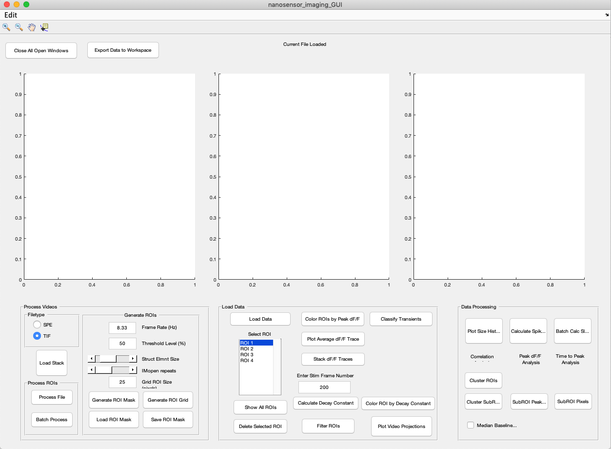
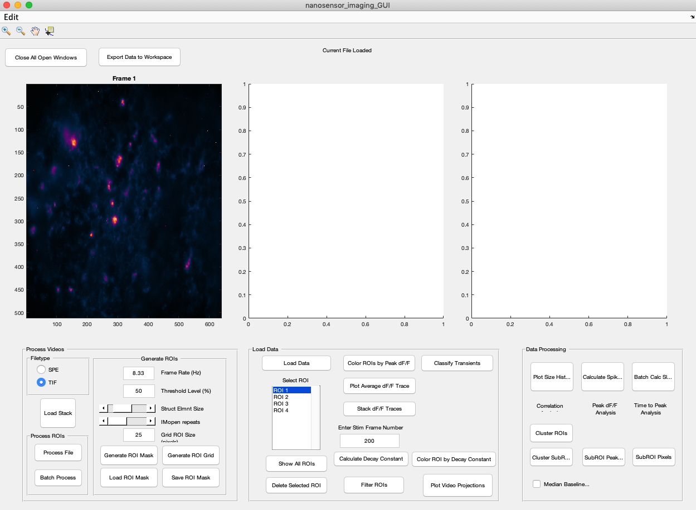
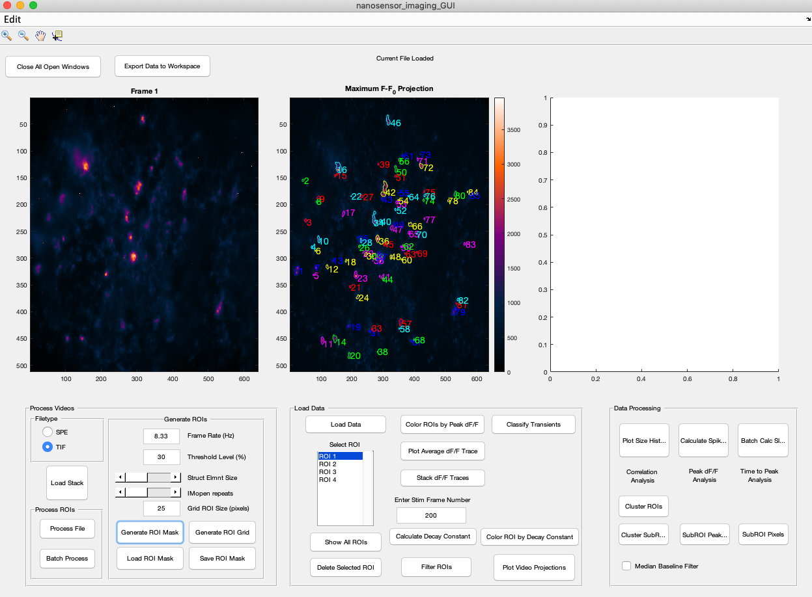
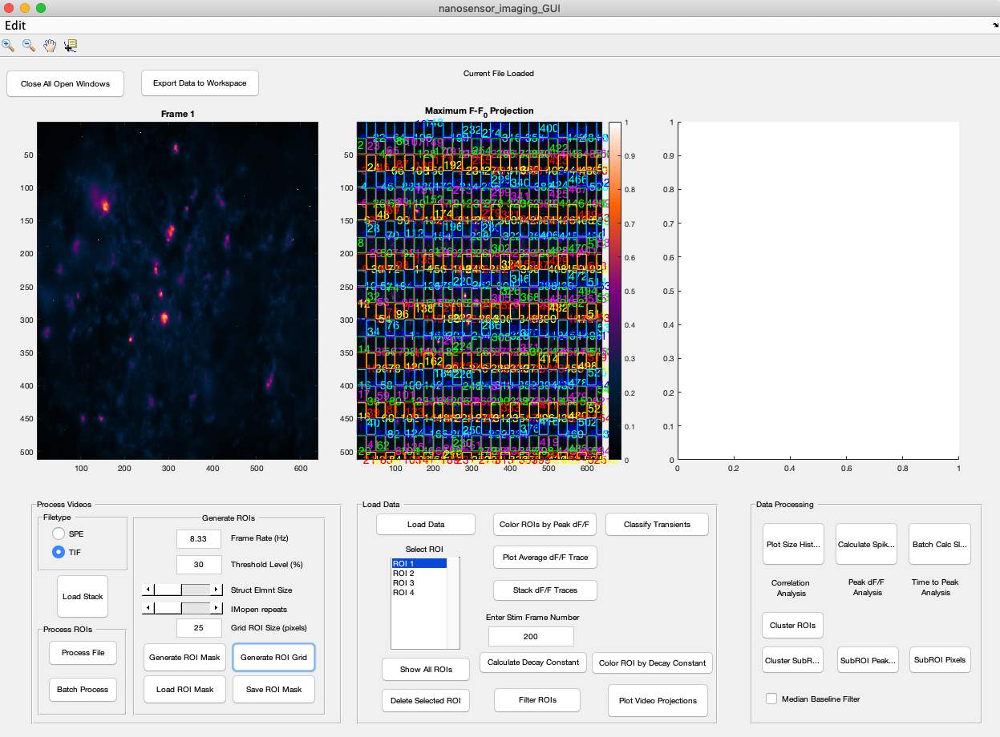
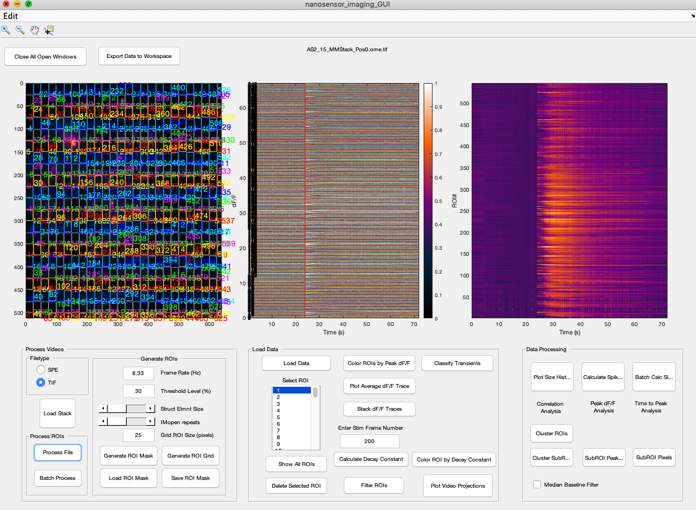
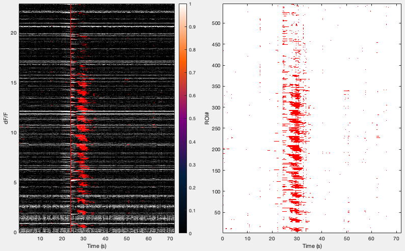
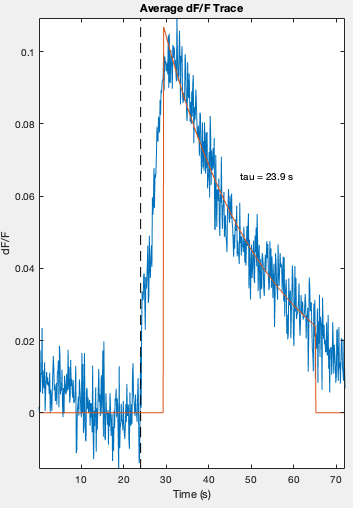
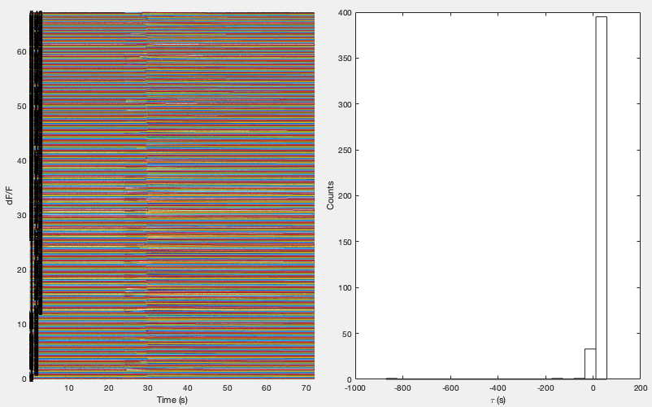

# Nanosensor-Brain-Imaging Tutorial
This is the tutorial for learning how to use the Nanosensor-Brain-Imaging package for MATLAB. This tutorial will bring you from
 the import of data through analysis of your data. 
 
##Opening the Interface
1.  Download the nanosensor_brain_imaging package, unpack and add it to your MATLAB path.
    * Remember to update to the latest version of the software to ensure optimal results

2. Open MATLAB and navigate to the `Nanosensor-Brain-Imaging` folder.

3. Open the GUI by running the `nanosensor_imaging_GUI.m` file

The result should look like this:   

## Processing Videos

1. Define filetype (SPE or TIF)
    * TIF should be checked by default
    * Landry Lab standard is TIF
    
2. Click on ***Load Stack*** button and select the your file of choice.
    * This should be the same filetype as you selected
    * A file browser window should open
    At this point your interface should look something like this after the file loads: 

3. Select Parameters for Regions of Interest (ROI)
    * Set the ***Frame Rate*** of your video 
        * Landry Lab standard is 8.33 Hz (default setting)
    * Set ***Threshold Level*** 
        * Values below this number of  % Change in fluorescence will be ignored.
    * Adjust ***Struct Elmnt Size*** and ***IMopen Repeats*** to desired values
        * Description to come 
    *  **Optional:** If Grid ROIs are desired set ***Grid ROI Size***
        * As noted, the unit of this is pixels. The numerical value imputed will be the size of each grid. 
        * Be careful at low values the image looks like a soup of colors 
    * **Note:** At this point nothing should change with the central graph
    
4. Click ***Generate ROI Mask*** or ***Generate ROI Grid*** depending on desired mask generation method.
    * **Note:** This may take a few seconds
    * ROI Mask 
    *  ROI Grid 
    
5. **Optional:**  Save or Load ROI Mask by clicking their respective buttons
    * Save will output a `.mat` file
    * Despite name this function works with both the Grid and Mask ROI Techniques    

6. Click ***Process File***
    * The result should look like this. 
   
 

**Note:** Batch Process is for individual images rather than a video. 

### Understanding Your Data
At this point, the data has been processed and now one can proceed to calculate values of interest. 
Such as dF/F or decay constants. As buttons are clicked in the center panel the graphs above will 
update to show the desired results.  

**Before Beginning:** Enter Stimulation Frame Number in the text box

**Optional:** Click ***Load Data*** and load in your `.mat` file of previous data

**Note:** Some of these calculations may take a few seconds. 

* Finding the dF/F of a particular ROI
    * Click the ROI number in the ***Select ROI*** list
    * This should place the ROI overlayed image on the left graph and dF/F vs Time(s) on the center graph
* "Heat Map" of ROIs
    * Click ***Color ROIs by Peak dF/F***
    * Heat Map will appear on the right graph
    * Example Heat Map for a ROI Grid: 
* Identification of Transients
    * Click ***Classify Transients*** 
    * Helpful to identify release events in one's data
    * Two Curves will be generated 
        * Middle Graph: dF/F [for each ROI] vs Time (s) 
        * Right Graph: ROI# vs Time (s)
    * Example: 
* Calculating an average dF/F
    * Click ***Plot Average dF/F Trace*** 
    * Result will yield a graph [dF/F vs Time (s)] on the central figure with an average decay constant (Tau)
    * Example:   
* Individual dF/F traces
    * Click ***Stack dF/F Traces***
    * Will result in a graph on the central figure [dF/F vs Time (s)] with all traces drawn and a line for stimulation time
* Identification of Decay Constants
    * Click  ***Calculate Decay Constants***
    * Result will plot:
        * Middle Graph: dF/F vs Time (s) for all ROIs
        * Right Graph: A histogram of all decay constants found calculated for each ROI
    * Example: 
* Plotting Decay Constants on Your Video
    * Click ***Color ROI by Decay Constant*** 
    * Each of the decay constants will be calculated and a heat map will be generated on the right panel
* Showing all ROIs with Numbers
    * Click ***Show all ROIs*** 
    * Result: All ROIs will be displayed in varying colors and be numbered.     
* Getting Rid of Outliers
    * If any ROIs seem to be nonsensical, the ROI can be removed by selecting its number under ***Select ROI*** then clicking ***Delete Selected ROI***
    
### Saving Your Data
While you were performing your data analysis, the program has already saved your data as `video_filename.mat` file in the same folder that your video file was in.

While this process should always work, you can save the data via the workspace as follows.
1. Click ***Export Data to Workspace*** in the top left corner of the GUI
2. Navigate to the main MATLAB window and look at the workspace
3. Right Click on `currentDataset` and select ***Save As*** then follow the prompts.
    * Current Dataset should be noted as a *1x1 struct*
    * This file should be saved as a `.mat` file
4. Explore your data in MATLAB by double clicking on `currentDataset`
    * Double Clicking on any field that has a value in blue will open a spreadsheet with that data

Once you have your data in the workspace you can directly play with your data by clicking on the file of interest.

More tutorial details to follow!
